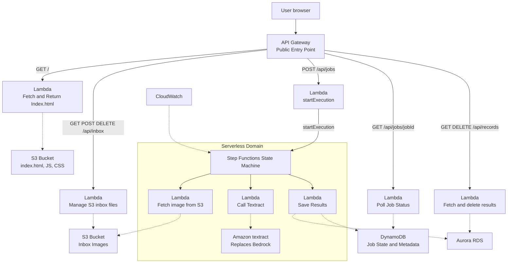

# Tia Kay and Amaya Owens  --  Final Project CMSC 471
## System Write-up
The system that we have developed will take images of handwritten lists and convert them to text. The user will interact with the system through their browser. The browser will be connected to the API Gateway to communicate with the backend. From the API Gateway, there are several lambda functions that can be invoked. There is a lambda function to fetch and return the index.html from the S3 Bucket so that the webpage displays properly. There is a lambda function that will manage the S3 inbox files to control which files are displayed. Another lambda function will fetch and delete results and update the Aurora RDS. One lambda function will check the job status in the DynamoDB every 200 seconds so that updates can be given to the user. There is a lambda function to start execution, which is connected to a step function state machine within a serverless domain. The step functions state machine can invoke lambda functions to fetch images from the S3 bucket, invoke Amazon's textract to digitize the handwritten text, and to save the results in the DynamoDB and Aurora RDS. The DynamoDB stores the job status. The Aurora RDS is used to maintain the shopping list. The CloudWatch service was also used with the step function state machine to monitor the website to help troubleshoot bugs and detect abnormal usage.

## Mermaid Diagram

## DevOps Board


## Gherkin Files
```gherkin
    Feature: Upload Files
        Scenario: Upload files by browsing the device
            Given the user has selected a file
            When the user selects the upload button
            Then the file will display in the inbox files
```

## User Stories
### Amaya's User Stories
1. As a user, I want to be able to upload a file
2. As a user, I want to be able to view a list of my uploaded files
3. As a user, I want to be able to delete a file
4. As a user, I want my files to persist
5. As a user, I want the user interface to be clear and easy to navigate

### Tia's User Stories

## Well-Architected Questions

## Cost Calculator
The estimate given by https://calculator.aws was $180 upfront and $27.99 per month, coming to $515.88 (including upfront cost) for 12 months. The services entered were Amazon API Gateway: 

## Template.yaml
```yaml
#template.yaml
Transform: AWS::Serverless-2016-10-31
Parameters:
  LabRoleArn:
    Type: String
    Description: The ARN of the LabRole AWS Learner Lab.
    Default: arn:aws:iam::595026604313:role/LabRole
Resources:
  Api:
    Type: AWS::Serverless::Api
    Properties:
      Name: !Sub
        - ${ResourceName} From Stack ${AWS::StackName}
        - ResourceName: Api
      StageName: Prod
      EndpointConfiguration: REGIONAL
      TracingEnabled: true
  # This function will use the front end to verify the API is up and running, and to test connectivity to other resources like S3
  HealthFunction:
    Type: AWS::Serverless::Function
    Properties:
      Description: !Sub
        - Stack ${AWS::StackName} Function ${ResourceName}
        - ResourceName: HealthFunction
      CodeUri: health_service
      Handler: handler.handler
      Runtime: python3.13
      Role: !Sub arn:aws:iam::${AWS::AccountId}:role/LabRole
      MemorySize: 3008
      Timeout: 30
      Tracing: Active
      Environment: {}
      Events:
        ApiGET:
          Type: Api
          Properties:
            Path: /api/health
            Method: GET
            RestApiId: !Ref Api
  HealthFunctionLogGroup:
    Type: AWS::Logs::LogGroup
    DeletionPolicy: Delete
    UpdateReplacePolicy: Delete
    Properties:
      LogGroupName: !Sub /aws/lambda/${HealthFunction}
      RetentionInDays: 7
  #This is the s3 bucket that holds information on the front end like the index.html file
  Bucket:
    Type: AWS::S3::Bucket
    Properties:
      BucketName: !Sub ${AWS::StackName}-bucket-${AWS::AccountId}
      BucketEncryption:
        ServerSideEncryptionConfiguration:
          - ServerSideEncryptionByDefault:
              SSEAlgorithm: aws:kms
              KMSMasterKeyID: alias/aws/s3
      PublicAccessBlockConfiguration:
        IgnorePublicAcls: true
        RestrictPublicBuckets: true
  BucketBucketPolicy:
    Type: AWS::S3::BucketPolicy
    Properties:
      Bucket: !Ref Bucket
      PolicyDocument:
        Id: RequireEncryptionInTransit
        Version: '2012-10-17'
        Statement:
          - Principal: '*'
            Action: '*'
            Effect: Deny
            Resource:
              - !GetAtt Bucket.Arn
              - !Sub ${Bucket.Arn}/*
            Condition:
              Bool:
                aws:SecureTransport: 'false'
  #This function will be used to access the index.html file in the s3 bucket, and to verify connectivity from the lambda function to the s3 bucket 
  StaticProxyFunction:
    Type: AWS::Serverless::Function
    Properties:
      Description: !Sub
        - Stack ${AWS::StackName} Function ${ResourceName}
        - ResourceName: StaticProxyFunction
      CodeUri: src/proxy
      Handler: proxy.proxy_handler
      Runtime: python3.13
      Role: !Sub arn:aws:iam::${AWS::AccountId}:role/LabRole
      MemorySize: 3008
      Timeout: 30
      Tracing: Active
      Environment:
        Variables:
          BUCKET_BUCKET_NAME: !Ref Bucket
          BUCKET_BUCKET_ARN: !GetAtt Bucket.Arn
      Events:
        ApiGET:
          Type: Api
          Properties:
            Path: /
            Method: GET
            RestApiId: !Ref Api
  StaticProxyFunctionLogGroup:
    Type: AWS::Logs::LogGroup
    DeletionPolicy: Delete
    UpdateReplacePolicy: Delete
    Properties:
      LogGroupName: !Sub /aws/lambda/${StaticProxyFunction}
      RetentionInDays: 7
  # This is the s3 bucket that will hold images uploaded by the user
  InboxBucket:
    Type: AWS::S3::Bucket
    Properties:
      BucketName: !Sub ${AWS::StackName}-inboxbuck-${AWS::AccountId}
      CorsConfiguration:
        CorsRules:
          - AllowedHeaders:
              - '*'
            AllowedMethods:
              - GET
              - POST
              - PUT
              - DELETE
            AllowedOrigins:
              - '*'
            MaxAge: 300
            ExposedHeaders:
              - ETag
      BucketEncryption:
        ServerSideEncryptionConfiguration:
          - ServerSideEncryptionByDefault:
              SSEAlgorithm: aws:kms
              KMSMasterKeyID: alias/aws/s3
  InboxBucketBucketPolicy:
    Type: AWS::S3::BucketPolicy
    Properties:
      Bucket: !Ref InboxBucket
      PolicyDocument:
        Id: RequireEncryptionInTransit
        Version: '2012-10-17'
        Statement:
          - Principal: '*'
            Action: '*'
            Effect: Deny
            Resource:
              - !GetAtt InboxBucket.Arn
              - !Sub ${InboxBucket.Arn}/*
            Condition:
              Bool:
                aws:SecureTransport: 'false'
  # This function is used to handle API calls to the /api/inbox endpoint, and to interact with the inbox s3 bucket to upload, delete, and list images
  LInbox:
    Type: AWS::Serverless::Function
    Properties:
      Description: !Sub
        - Stack ${AWS::StackName} Function ${ResourceName}
        - ResourceName: LInbox
      CodeUri: src/inbox
      Handler: handler.handler
      Runtime: python3.13
      Role: !Sub arn:aws:iam::${AWS::AccountId}:role/LabRole
      MemorySize: 3008
      Timeout: 30
      Tracing: Active
      Environment:
        Variables:
          INBOX_BUCKET_NAME: !Ref InboxBucket
      Events:
        ApiGETInbox:
          Type: Api
          Properties:
            Path: /api/inbox
            Method: GET
            RestApiId: !Ref Api
        ApiPOSTInbox:
          Type: Api
          Properties:
            Path: /api/inbox
            Method: POST
            RestApiId: !Ref Api
        ApiDELETEInbox:
          Type: Api
          Properties:
            Path: /api/inbox/{key}
            Method: DELETE
            RestApiId: !Ref Api
  LInboxLogGroup:
    Type: AWS::Logs::LogGroup
    DeletionPolicy: Delete
    UpdateReplacePolicy: Delete
    Properties:
      LogGroupName: !Sub /aws/lambda/${LInbox}
      RetentionInDays: 7
  # This function is used to submit jobs to the state machine from the Inbox s3 bucket
  lsubmit:
    Type: AWS::Serverless::Function
    Properties:
      Description: !Sub
        - Stack ${AWS::StackName} Function ${ResourceName}
        - ResourceName: LSubmit
      CodeUri: src/lsubmit
      Handler: handler.handler
      Runtime: python3.13
      Role: !Sub arn:aws:iam::${AWS::AccountId}:role/LabRole
      MemorySize: 3008
      Timeout: 30
      Tracing: Active
      Environment:
        Variables:
          JOB_TABLE: !Ref JobsTable
          STATE_MACHINE_ARN: !Ref StateMachine

      Events:
        SubmitAPI:
          Type: Api
          Properties:
            Path: /api/jobs
            Method: POST
            RestApiId: !Ref Api

  lsubmitLogGroup:
    Type: AWS::Logs::LogGroup
    DeletionPolicy: Delete
    UpdateReplacePolicy: Delete
    Properties:
      LogGroupName: !Sub /aws/lambda/${lsubmit}
      RetentionInDays: 7
  JobsTable:
    Type: AWS::DynamoDB::Table
    Properties:
      AttributeDefinitions:
        - AttributeName: jobId
          AttributeType: S
      BillingMode: PAY_PER_REQUEST
      KeySchema:
        - AttributeName: jobId
          KeyType: HASH
  # This function fetches images from the Inbox s3 bucket
  L1Fetch:
    Type: AWS::Serverless::Function
    Properties:
      Description: !Sub
        - Stack ${AWS::StackName} Function ${ResourceName}
        - ResourceName: L1Fetch
      CodeUri: src/statemachine
      Handler: l1fetch.handler
      Runtime: python3.13
      Role: !Sub arn:aws:iam::${AWS::AccountId}:role/LabRole
      MemorySize: 3008
      Timeout: 30
      Tracing: Active
      Environment:
        Variables:
          INBOXBUCKET_BUCKET_NAME: !Ref InboxBucket
          INBOXBUCKET_BUCKET_ARN: !GetAtt InboxBucket.Arn
      Policies:
        - Statement:
            - Effect: Allow
              Action:
                - s3:GetObject
                - s3:GetObjectAcl
                - s3:GetObjectLegalHold
                - s3:GetObjectRetention
                - s3:GetObjectTorrent
                - s3:GetObjectVersion
                - s3:GetObjectVersionAcl
                - s3:GetObjectVersionForReplication
                - s3:GetObjectVersionTorrent
                - s3:ListBucket
                - s3:ListBucketMultipartUploads
                - s3:ListBucketVersions
                - s3:ListMultipartUploadParts
                - s3:AbortMultipartUpload
                - s3:DeleteObject
                - s3:DeleteObjectVersion
                - s3:PutObject
                - s3:PutObjectLegalHold
                - s3:PutObjectRetention
                - s3:RestoreObject
              Resource:
                - !Sub arn:${AWS::Partition}:s3:::${InboxBucket}
                - !Sub arn:${AWS::Partition}:s3:::${InboxBucket}/*
  L1FetchLogGroup:
    Type: AWS::Logs::LogGroup
    DeletionPolicy: Delete
    UpdateReplacePolicy: Delete
    Properties:
      LogGroupName: !Sub /aws/lambda/${L1Fetch}
      RetentionInDays: 7
  # This function is used to call on the images fetched by L1Fetch 
  L2Call:
    Type: AWS::Serverless::Function
    Properties:
      Description: !Sub
        - Stack ${AWS::StackName} Function ${ResourceName}
        - ResourceName: L2Call
      CodeUri: src/statemachine
      Handler: l2call.handler
      Runtime: python3.13
      Role: !Sub arn:aws:iam::${AWS::AccountId}:role/LabRole
      MemorySize: 3008
      Timeout: 30
      Tracing: Active
      Environment:
        Variables:
          JOBSTABLE_TABLE_NAME: !Ref JobsTable
          JOBSTABLE_TABLE_ARN: !GetAtt JobsTable.Arn
      Policies:
        - DynamoDBCrudPolicy:
            TableName: !Ref JobsTable
  L2CallLogGroup:
    Type: AWS::Logs::LogGroup
    DeletionPolicy: Delete
    UpdateReplacePolicy: Delete
    Properties:
      LogGroupName: !Sub /aws/lambda/${L2Call}
      RetentionInDays: 7
  
  # This function is used to save the results of the image processing to the records table 
  L3Save:
    Type: AWS::Serverless::Function
    Properties:
      Description: !Sub
        - Stack ${AWS::StackName} Function ${ResourceName}
        - ResourceName: L3Save
      CodeUri: src/statemachine
      Handler: l3save.handler
      Runtime: python3.13
      Role: !Sub arn:aws:iam::${AWS::AccountId}:role/LabRole
      MemorySize: 3008
      Timeout: 30
      Tracing: Active
      Environment:
        Variables:
          JOB_TABLE: !Ref JobsTable
          DB_NAME: shoppinglist
          RECORDS_TABLE: !Ref RecordsTable
  L3SaveLogGroup:
    Type: AWS::Logs::LogGroup
    DeletionPolicy: Delete
    UpdateReplacePolicy: Delete
    Properties:
      LogGroupName: !Sub /aws/lambda/${L3Save}
      RetentionInDays: 7
  # This is the state machine that is comprised of L1Fetch, L2Call, and L3Save, and is responsible for the image processing workflow
  StateMachine:
    Type: AWS::Serverless::StateMachine
    Properties:
      Role: !Sub arn:aws:iam::${AWS::AccountId}:role/LabRole
      Definition:
        Comment: Shopping list image procccessing piepline
        StartAt: FetchImage
        States:
          FetchImage:
            Type: Task
            Resource: arn:aws:states:::lambda:invoke
            Parameters:
              FunctionName: ${L1FetchArn}
              Payload.$: $
            ResultSelector:
              jobId.$: $.Payload.jobId
              filename.$: $.Payload.filename
              bucket.$: $.Payload.bucket
            Next: CallTextract
          CallTextract:
            Type: Task
            Resource: arn:aws:states:::lambda:invoke
            Parameters:
              FunctionName: ${L2CallArn}
              Payload.$: $
            ResultSelector:
              jobId.$: $.Payload.jobId
              filename.$: $.Payload.filename
              bucket.$: $.Payload.bucket
            Next: SaveResults
          SaveResults:
            Type: Task
            Resource: arn:aws:states:::lambda:invoke
            Parameters:
              FunctionName: ${L3SaveArn}
              Payload.$: $
            ResultSelector:
              jobId.$: $.Payload.jobId
              rowCount.$: $.Payload.rowCount
            End: true
      Logging:
        Level: ALL
        IncludeExecutionData: true
        Destinations:
          - CloudWatchLogsLogGroup:
              LogGroupArn: !GetAtt StateMachineLogGroup.Arn
      Tracing:
        Enabled: true
      Type: STANDARD
      DefinitionSubstitutions:
        L1FetchArn: !GetAtt L1Fetch.Arn
        L2CallArn: !GetAtt L2Call.Arn
        L3SaveArn: !GetAtt L3Save.Arn
  StateMachineLogGroup:
    Type: AWS::Logs::LogGroup
    Properties:
      LogGroupName: !Sub
        - /aws/vendedlogs/states/${AWS::StackName}-${ResourceId}-Logs
        - ResourceId: StateMachine
  
  # This function is used to poll for the status of a job and return the results to the front end
  LPoll:
    Type: AWS::Serverless::Function
    Properties:
      Description: !Sub
        - Stack ${AWS::StackName} Function ${ResourceName}
        - ResourceName: LPoll
      CodeUri: src/lpoll
      Handler: lpoll.handler
      Runtime: python3.13
      Role: !Sub arn:aws:iam::${AWS::AccountId}:role/LabRole
      MemorySize: 3008
      Timeout: 30
      Tracing: Active
      Environment:
        Variables:
          JOB_TABLE: !Ref JobsTable

      Events:
        ApiGETPoll:
          Type: Api
          Properties:
            Path: /api/jobs/{jobId}
            Method: GET
            RestApiId: !Ref Api
  LPollLogGroup:
    Type: AWS::Logs::LogGroup
    DeletionPolicy: Delete
    UpdateReplacePolicy: Delete
    Properties:
      LogGroupName: !Sub /aws/lambda/${LPoll}
      RetentionInDays: 7
  # This function fetches the results of image processing from the records table and returns them to the front end
  LRecords:
    Type: AWS::Serverless::Function
    Properties:
      Description: !Sub
        - Stack ${AWS::StackName} Function ${ResourceName}
        - ResourceName: LRecords
      CodeUri: src/lrecords
      Handler: lrecords.handler
      Runtime: python3.13
      Role: !Sub arn:aws:iam::${AWS::AccountId}:role/LabRole
      MemorySize: 3008
      Timeout: 30
      Tracing: Active
      Environment:
        Variables:
          # DB_NAME: shoppinglist
          RECORDS_TABLE: !Ref RecordsTable
      Events:
        ApiGETRecords:
          Type: Api
          Properties:
            Path: /api/records
            Method: GET
            RestApiId: !Ref Api
  LRecordsLogGroup:
    Type: AWS::Logs::LogGroup
    DeletionPolicy: Delete
    UpdateReplacePolicy: Delete
    Properties:
      LogGroupName: !Sub /aws/lambda/${LRecords}
      RetentionInDays: 7
  # This is the table that holds the results of the image processing, and works with the L3Save and LRecords functions to save and retrieve the results of the image processing
  RecordsTable:
    Type: AWS::DynamoDB::Table
    Properties:
      AttributeDefinitions:
        - AttributeName: id
          AttributeType: S
      BillingMode: PAY_PER_REQUEST
      KeySchema:
        - AttributeName: id
          KeyType: HASH
# This defines the stack outputs
Outputs:
  HelloWorldApi:
    Description: 'API Gateway endpoing URL for Prod:'
    Value: !Sub https://${Api}.execute-api.${AWS::Region}.amazonaws.com/Prod/
  FrontendBucketName:
    Description: S3 Bucket name holding our index.html
    Value: !Ref Bucket
  FrontendDeployCommand:
    Description: Run this command to deploy index.html to s3 bucket
    Value: !Sub aws s3 cp .\wwwroot\index.html s3://${Bucket}/index.html
  FrontendTeardownCommand:
    Description: Run this command to remove index.html from s3 bucket
    Value: !Sub aws s3 rm s3://${Bucket}/index.html
  InboxBucketTeardownCommand:
    Description: Run this command to remove any uploads to our inbox s3 bucket
    Value: !Sub aws s3 rm s3://${InboxBucket}/ --recursive --dryrun
  RemoveStackCommand:
    Description: Run this command to remove this stack
    Value: !Sub |
      aws cloudformation delete-stack --stack-name ${AWS::StackName}
      --region us-east-1
```

## Finished Website


