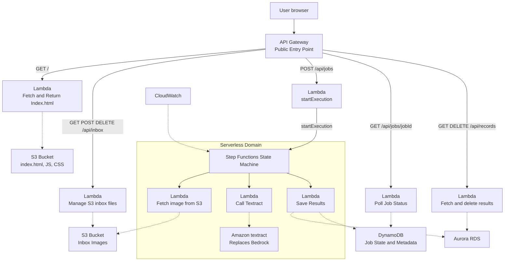

# Tia Kay and Amaya Owens  --  Final Project CMSC 471
## System Write-up
The system that we have developed will take images of handwritten lists and convert them to text. The user will interact with the system through their browser. The browser will be connected to the API Gateway to communicate with the backend. From the API Gateway, there are several lambda functions that can be invoked. There is a lambda function to fetch and return the index.html from the S3 Bucket so that the webpage displays properly. There is a lambda function that will manage the S3 inbox files to control which files are displayed. Another lambda function will fetch and delete results and update the Aurora RDS. One lambda function will check the job status in the DynamoDB every 200 seconds so that updates can be given to the user. There is a lambda function to start execution, which is connected to a step function state machine within a serverless domain. The step functions state machine can invoke lambda functions to fetch images from the S3 bucket, invoke Amazon's textract to digitize the handwritten text, and to save the results in the DynamoDB and Aurora RDS. The DynamoDB stores the job status. The Aurora RDS is used to maintain the shopping list. The CloudWatch service was also used with the step function state machine to monitor the website to help troubleshoot bugs and detect abnormal usage.

## Mermaid Diagram

## DevOps Board


## Gherkin Files
```gherkin
    Feature: Upload Files
        Scenario: Upload files by browsing the device
            Given the user has selected a file
            When the user selects the upload button
            Then the file will display in the inbox files
```

## User Stories
### Amaya's User Stories
1. As a user, I want to be able to upload a file
2. As a user, I want to be able to view a list of my uploaded files
3. As a user, I want to be able to delete a file
4. As a user, I want my files to persist
5. As a user, I want the user interface to be clear and easy to navigate


## Well-Architected Questions

## Cost Calculator
The estimate given by https://calculator.aws was $180 upfront and $27.99 per month, coming to $515.88 (including upfront cost) for 12 months. The services entered were Amazon API Gateway: 

## Template.yaml

## Finished Website


