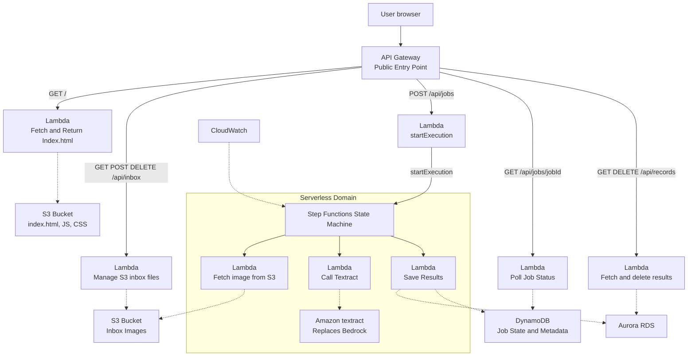

Tia Kay and Amaya Owens  --  Final Project CMSC 471

Our project seamlessly integrates all pillars of the AWS Well Architected Framework. For the operational excellence pillar, we had a clear idea of what we were creating from the beginning. This project will take handwritten notes and convert them into a digital text version of the note. We used some services provided by AWS including IAM, CloudFormation, AWS LearnerLab, and S3. 

The estimate given by https://calculator.aws was $180 upfront and $27.99 per month, coming to $515.88 (including upfront cost) for 12 months. The services entered were Amazon API Gateway: 

