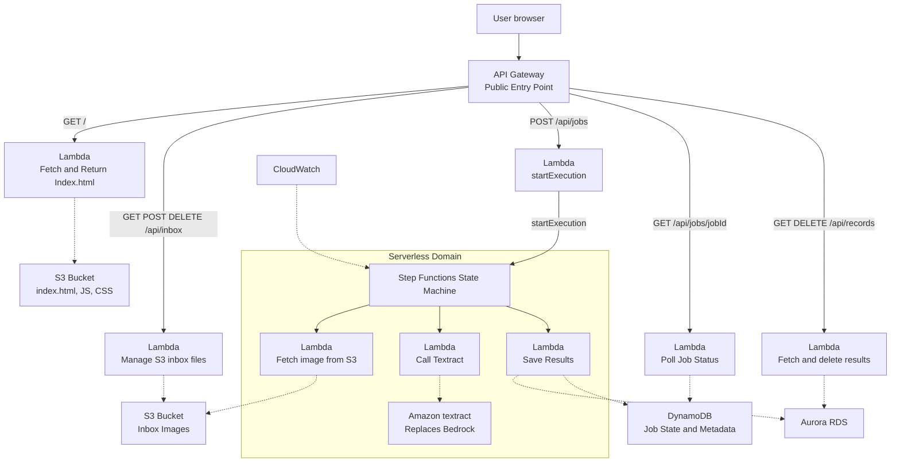

# Tia Kay and Amaya Owens  --  Final Project CMSC 471
## System Write-up


## Mermaid Diagram

## DevOps Board


## Gherkin Files
```gherkin
    Feature: Upload Files
        Scenario: Upload files by browsing the device
            Given the user has selected a file
            When the user selects the upload button
            Then the file will display in the inbox files
```

## User Stories
### Amaya's User Stories
1. As a user, I want to be able to upload a file
2. As a user, I want to be able to view a list of my uploaded files
3. As a user, I want to be able to delete a file
4. As a user, I want my files to persist
5. As a user, I want the user interface to be clear and easy to navigate


## Well-Architected Questions

## Cost Calculator
The estimate given by https://calculator.aws was $180 upfront and $27.99 per month, coming to $515.88 (including upfront cost) for 12 months. The services entered were Amazon API Gateway: 

## Template.yaml

## Finished Website


